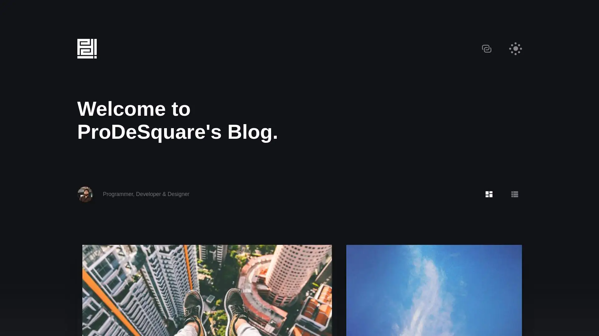

# ProDeSquare's Blog



## Built with
- [Hugo](https://github.com/gohugoio/hugo)
- [Novela Theme](https://github.com/forestryio/hugo-theme-novela)

## How to run

- Make sure hugo is installed. To install it on **archlinux** run:
    ```
    $ sudo pacman -S hugo
    ```
- Check the installed version
    ```shell
    $ hugo version
    ```
- Clone the repo
    ```
    $ git clone https://github.com/ProDeSquare/blog.git
    $ git submodule init
    $ git submodule update
    ```
- From the directory run:
    ```shell
    $ hugo server
    ```

## Setup for yourself

- Change the **hero section title** from `/content/_index.md`
- About page can be edited from `/content/about.md`
- Create Authors
    - Authors are located in `/content/authors/**/_index.md`
    - Delete the existing one or update the **directory name** and **file contents**
- Posts
    - Delete all the posts in the `/content/post/` directory
        ```shell
        $ rm -rf content/post/*
        ```
    - Run the following command to create new with front-matter based on `archetypes/default.md`
        ```shell
        $ hugo new post/<my-post-title>.md
        ```
- Static files are stored in `/static` directory
- To tweak the theme and change the logo, look at [Novela Guide](https://github.com/forestryio/hugo-theme-novela#customization)

## Deployment
You can use [Netlify](https://www.netlify.com/) or you can even use your **own server**. Run the build command and deploy the `/public` folder to your server.
```shell
$ hugo -D
```

### My environment
```shell
$ hugo version
hugo v0.101.0+extended linux/amd64 BuildDate=unknown
```

## Donate
- Bitcoin: `18Hd1waYh5uG6nWRboXGD3Q3vaPzWRMgQH`
- Ethereum: `0x90b3f1495724e9e6a18372cb939df1d7166337b9`
- Monero: `88ZscYwoNmTcf2xM1d6UFuGr2eyNh8V6kU2NkZFC7zTA84fWjjHMxrnDdHrquFm1sFRCvGXejvz2bBfBRZLNE5DQ3fngypz`
